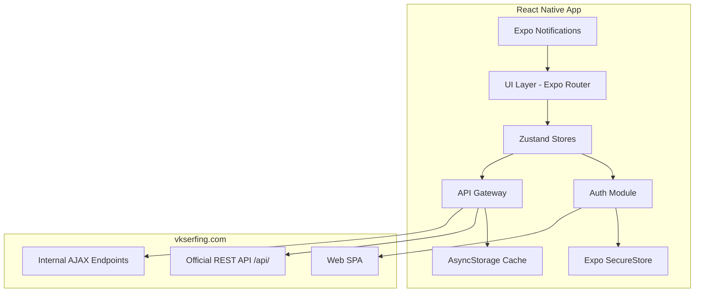

# Техническое задание (ТЗ): VKSerfing Mobile Bot

**Версия:** 1.0  
**Дата:** 20.06.2026  
**Платформы:** Android 8+, iOS 15+  
**Стек:** React Native (Expo SDK 52), TypeScript

---

## 1. Обзор проекта

### 1.1 Назначение

Мобильное кроссплатформенное приложение-клиент для [vkserfing.com](https://vkserfing.com) — биржи заданий и продвижения в социальных сетях (VK, Telegram, Instagram, TikTok и др.). Приложение позволяет:

- **Исполнителям** — просматривать и выполнять задания, отслеживать баланс, получать уведомления.
- **Заказчикам** — управлять кампаниями через официальный API (при наличии токена).

### 1.2 Ограничения платформы vkserfing.com

| Аспект | Статус |
|--------|--------|
| Официальный REST API | Только для **заказчиков** (рекламодателей). Токен выдаётся по запросу в техподдержку |
| API для исполнителей | **Не документирован** публично |
| Авторизация | Через привязку соцсетей (VK ID, Telegram-бот, Instagram bio-верификация и др.) |
| Чаты/ЛС на сайте | Отсутствуют (есть Telegram-бот для авторизации) |

**Вывод:** Архитектура приложения — **гибридная**: WebView-авторизация + cookie-сессия + прокси-слой к внутренним эндпоинтам сайта + официальный API для заказчиков.

### 1.3 Соответствие политикам магазинов

- Не автоматизировать действия в сторонних соцсетях без явного согласия пользователя.
- Прозрачное описание функций в App Store / Google Play.
- Не обходить CAPTCHA и антибот-защиту программно.
- Соблюдение [Пользовательского соглашения](https://vkserfing.com) vkserfing.com.

---

## 2. Архитектура

### 2.1 Диаграмма компонентов



### 2.2 Слои приложения

| Слой | Ответственность |
|------|-----------------|
| **Presentation** | Экраны (Expo Router), компоненты, темизация |
| **State** | Zustand: auth, tasks, notifications, settings |
| **Domain** | Бизнес-логика: выполнение заданий, валидация |
| **Data** | API-клиенты, SecureStore, AsyncStorage, WebView bridge |
| **Infrastructure** | Push-уведомления, фоновый polling, шифрование |

### 2.3 Стратегия интеграции с сайтом

#### A. Официальный API (заказчики)

```
GET/POST https://vkserfing.com/api/{resource}.{method}?token={api_key}
```

Ресурсы: `campaign`, `project`, `user`, `util`.

#### B. WebView-авторизация (исполнители)

1. Открыть `https://vkserfing.com/login` в WebView.
2. Пользователь проходит OAuth/верификацию соцсети.
3. Извлечь `Set-Cookie` (session ID) через `onNavigationStateChange` + injected JS.
4. Сохранить cookies в SecureStore (зашифровано на уровне ОС).

#### C. Internal API Proxy (исполнители)

Внутренние эндпоинты SPA (определяются reverse-engineering, **заглушки в прототипе**):

| Endpoint (предполагаемый) | Метод | Назначение |
|---------------------------|-------|------------|
| `/ajax/tasks/list` | GET | Список доступных заданий |
| `/ajax/tasks/{id}/complete` | POST | Отметить выполнение |
| `/ajax/user/profile` | GET | Профиль, баланс |
| `/ajax/user/notifications` | GET | Уведомления |
| `/ajax/search` | GET | Поиск |

> **Важно:** Точные URL необходимо верифицировать через DevTools → Network на живом сайте. Прототип использует конфигурируемый `InternalApiConfig`.

---

## 3. Функциональные требования

### 3.1 Аутентификация

| ID | Требование | Реализация |
|----|------------|------------|
| AUTH-01 | Вход через WebView (VK, Telegram, email) | `AuthWebViewScreen` |
| AUTH-02 | Хранение session cookie в SecureStore | `SecureStorageService` |
| AUTH-03 | Поддержка нескольких аккаунтов | `AccountManager` + переключатель |
| AUTH-04 | API-токен заказчика (опционально) | Отдельное поле в настройках |
| AUTH-05 | Автовыход при истечении сессии | Interceptor 401 → logout |

### 3.2 Задания и контент

| ID | Требование | Реализация |
|----|------------|------------|
| TASK-01 | Лента доступных заданий с фильтрами | `TasksScreen` + pull-to-refresh |
| TASK-02 | Детали задания, переход к выполнению | `TaskDetailScreen` + Deep Link |
| TASK-03 | История выполненных заданий | Локальный кэш + API |
| TASK-04 | Поиск заданий/пользователей | `SearchScreen` |

### 3.3 Уведомления

| ID | Требование | Реализация |
|----|------------|------------|
| NOTIF-01 | Push при новых заданиях | Expo Notifications + background fetch |
| NOTIF-02 | Локальные уведомления о балансе | Scheduled notifications |
| NOTIF-03 | Настройка звука/вибрации | `NotificationSettings` |

### 3.4 Заказчик (API)

| ID | Требование | Реализация |
|----|------------|------------|
| ADV-01 | Просмотр кампаний | `campaign.get` |
| ADV-02 | Создание/редактирование кампаний | `campaign.add`, `campaign.edit` |
| ADV-03 | Баланс | `user.balance` |

---

## 4. Нефункциональные требования

### 4.1 Безопасность

- **SecureStore** (Keychain/Keystore) для cookies и API-токенов.
- **Certificate pinning** (рекомендуется для production через `react-native-ssl-pinning`).
- Не логировать токены в production.
- Обфускация JS-бандла (Metro + ProGuard/R8 для Android).

### 4.2 Производительность

- Кэш заданий: TTL 5 мин, stale-while-revalidate.
- Пагинация: offset/limit.
- Lazy loading изображений.
- Hermes engine (включён в Expo 52).

### 4.3 UI/UX

- Adaptive layout (phone/tablet).
- Dark/Light theme (system + manual).
- Pull-to-refresh, skeleton loaders.
- Haptic feedback на действия.

---

## 5. Структура проекта

```
vkserfing-bot-app/
├── app/                    # Expo Router screens
│   ├── (auth)/login.tsx
│   ├── (tabs)/             # Main tabs
│   │   ├── tasks.tsx
│   │   ├── search.tsx
│   │   ├── notifications.tsx
│   │   └── profile.tsx
│   └── _layout.tsx
├── src/
│   ├── api/                # API clients
│   ├── components/         # UI components
│   ├── hooks/              # Custom hooks
│   ├── services/           # Storage, notifications
│   ├── store/              # Zustand stores
│   ├── theme/              # Colors, typography
│   └── types/              # TypeScript types
├── docs/
│   └── DEPLOYMENT.md
├── TECHNICAL_SPEC.md       # This file
└── package.json
```

---

## 6. Модель данных

```typescript
interface UserAccount {
  id: string;
  username: string;
  role: 'executor' | 'advertiser';
  balance: number;
  sessionCookie?: string;
  apiToken?: string;
  linkedSocials: SocialLink[];
}

interface Task {
  id: string;
  type: 'like' | 'subscribe' | 'repost' | 'comment' | 'view';
  platform: 'vk' | 'telegram' | 'instagram' | 'tiktok' | 'threads' | 'pinterest' | 'likee';
  title: string;
  reward: number;
  url: string;
  status: 'available' | 'in_progress' | 'completed' | 'failed';
  expiresAt?: string;
}

interface Notification {
  id: string;
  type: 'task' | 'balance' | 'system';
  title: string;
  body: string;
  read: boolean;
  createdAt: string;
}
```

---

## 7. API Reference (официальный)

### Базовый URL
`https://vkserfing.com/api/`

### Формат ответа
```json
{ "status": "success", "data": {} }
{ "status": "error", "error": { "code": "TOKEN_NOT_EXIST", "message": "..." } }
```

### Методы

| Метод | Описание |
|-------|----------|
| `campaign.get` | Список заказов (count, offset, filters) |
| `campaign.getById` | Заказ по ID |
| `campaign.add` | Создание заказа |
| `campaign.edit` | Редактирование (status: pause/active) |
| `campaign.logs` | Исполнители задания |
| `project.*` | CRUD папок проектов |
| `user.balance` | Баланс |
| `util.getCountries` | Справочник стран |
| `util.getCities` | Справочник городов |

---

## 8. Roadmap

| Фаза | Срок | Deliverables |
|------|------|--------------|
| MVP | 4 нед | Auth, task feed, profile, push |
| v1.1 | +2 нед | Multi-account, search, dark theme |
| v1.2 | +3 нед | Advertiser API panel, statistics |
| v2.0 | +4 нед | Background task runner, widgets |

---

## 9. Риски и митигация

| Риск | Вероятность | Митигация |
|------|-------------|-----------|
| Блокировка аккаунта за автоматизацию | Высокая | Ручное подтверждение выполнения, rate limiting |
| Изменение внутреннего API | Средняя | Абстракция `InternalApiClient`, feature flags |
| Отказ App Store (automation) | Средняя | Позиционирование как «клиент биржи», не бот |
| Нет executor API | Высокая | WebView fallback для всех операций |

---

## 10. Альтернативные подходы

1. **PWA** — быстрее в разработке, но ограничен push на iOS и нет SecureStore.
2. **Flutter** — аналогичная архитектура, `flutter_secure_storage`, `webview_flutter`.
3. **Native (Swift/Kotlin)** — максимальная производительность, двойная разработка.
4. **Full WebView shell** — минимум кода, но плохой UX и ограничения store policies.

**Выбрано:** React Native + Expo — баланс скорости, экосистемы и доступа к native APIs.
